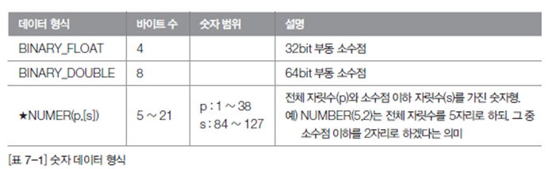

# 00.Oracle Type

### 숫자 데이터 형식

-숫자형 데이터 형식은 정수 , 실수 등의 숫자를 표현함.⇒대표적으로 NUMBER를 사용

### 문자 데이터 형식

-CHAR , NCHAR 형식은 고정길이 문자형으로 자릿수가 고정되어 있음

한글을 사용하면 정확히 Byte를 맞추기 어렵기때문에 VARCHAR2 많이 를 사용함.

### 이진 데이터 형식

BLOB이나 BFILE은 주로 이미지, 동영상, 음악, 지도 데이터 등을 저장하기 위한 데이터 형식임.

⇒BLOB은 많이 사용되나 BFILE은 데이터베이스 이전,파일관리의 어려움등으로 많이사용안함

### 날짜와 시간 데이터 형식

Date가 많이 사용됨

### 기타 데이터 형식

