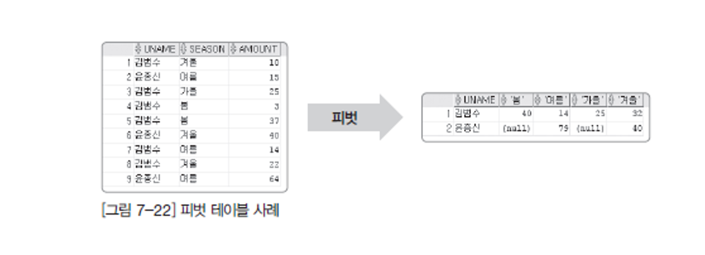

# PIVOT(집계 함수)

##  - 피벗Pivot은 한 열에 포함된 여러 값을 출력하고, 이를 여러 열로 변환하여 테이블 반환 식을 회전하고 필요하면 집계까지 수행하는 것을 말함.


```sql

SELECT * FROM PIVOTTEST -- PIVOT시킬 테이블
PIVOT ( SUM(amount)) --반드시 함수로 그룹핑을 해줘야한다.
    FOR season      --피벗으로 보여줄 데이터가 있는 컬럼과 데이터를 지정
    IN ('봄','여름','가을','겨울');
```

<aside>
💡 
 집계를 낼때 월 또는 계절 , 분기등으로 세로로 된 데이터를 가로 형태로 보여줄때 많이 사용하며 JAVA나 다른 백엔드 언어로도 처리가 가능하다.

</aside>




##
