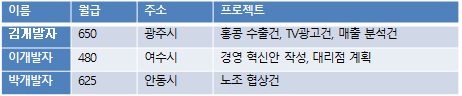

# 정규화

## 제 1 정규화

- **정규화는 테이블을 재구성하여 논리적 구조를 개선하는 절차이다.**
- **중복되는 데이터를 제거하여 저장 공간을 절약하고 전체적인 성능을 향상시킨다**.
- **규칙에 따라 테이블이나 필드를 세분화하면 관리 편의성도 좋아진다.**
- 오랜 기간동안 똑똑한 학자들이 숱한 시행착오를 거쳐 정리한 정제된 정규화 공식을 배우고 따르는 것이 좋다.
- 1~6까지 번호가 붙어 있다.
제 1 정규화는 필드의 데이터를 원자화(Atomicity)한다. 필드에는 단일값을 저장하고 필드끼리는 독립적이어야 한다.

<aside>
💡 월급, 주소 필드에 단일값을 저장하며 아무런 연관이 없어 원자성을 확보했다.
프로젝트는 한 직원이 여러 건을 맡을 수 있어 콤마로 구분하여 나열해 놓았다.
저장의 목적은 달성했지만 원자성이 없어 골치 아픈 문제가 발생한다.

</aside>

### 해당 프로젝트 필드의 문제점

- 프로젝트 개수에 제한이 없어 필드 길이를 충분히 할당해야 한다.
- 단일값이 아니어서 = 연산자로 비교할 수 없으며 WHERE project LIKE '%홍콩수출건%' 식으로 부분 문자열을 검색해야 한다.
- 수정은 더 골때린다. 이관이 어렵다.

필드를 여러개로 나누어 원자성을 확보한경우

## 1정규화에서 해야할것

- 프로젝트 개수에 제한이 없으며 기억 장소도 꼭 필요한 만큼만 사용한다.
- 프로젝트 테이블에 상세 정보를 추가하기도 쉽다.
- 프로젝트 이관건은 다음 쿼리 하나로 해결된다.
UPDATE tProject SET 담당자='문종민' WHERE 프로젝트='TV 광고건';
- 외부 테이블에 대한 참조를 가지는 키를 외래키(Foreign Key)라고 부르며 양 테이블의 연결고리 역할을 한다.
- 특정 직원이 맡은 프로젝트를 조사하려면 외래키를 직원명으로 검색한다.
SELECT 프로젝트명 FROM tProject WHERE 담당자 = '김상형';
- 관계를 맺는 테이블은 누가 업무의 중심인가에 따라 부모, 자식 관계가 된다. 업무의 주체를부모 또는 마스터(Master)라고 하며 반대쪽을 자식 또는 디테일(Detail)이라고 한다.

## 제 2정규화

- **일반 필드를 모두 기본키에 종속시키는 것이다.**
- **기본키를 알면 나머지 정보도 알 수 있다는 뜻이다.**
- **일반 필드끼리는 종속 관계가 없으며 상호 독립적이다.**

- 프로젝트 번호에 따라 프로젝트 이름과 담당자가 결정되므로 이들은 종속 관계이다.
- 담당자의 주소나 월급은 프로젝트와는 직접적인 상관이 없다.
- 프로젝트 테이블에 담당자만 기록해 두면 나머지 정보는 직원 테이블에서 언제든지 조사할 수 있다.
- 단일 기본키에서는 이런 실수가 금방 눈에 띄지만 복합키에서는 좀 헷갈린다.

- 모든 필드는 복합키 전체에 종속되어야 하며 일부에만 종속되서는 안된다.
- 고객 한명이 여러 건의 주문을 낼 수 있어 고객명과 주문번호를 복합키로 설정

## 제 3 정규화

- **기본키가 아닌 일반 필드끼리 서로 종속되지 않도록 하는 것이다.**
- **직원 테이블에 직원이 가입한 사내 동호회 관련 필드를 추가**

- 월급과 가입한 동호회 이름은 기본키인 직원명에 종속적이다.

### 동호회의 방번호와 회원수는 기본키가 아닌 동호회 필드에 종속적이다.

- 기억 장소가 낭비된다.
- 이 테이블의 엔터티는 직원이지 동호회가 아니다.
- 중복 정보를 변경하기 번거롭다.
- 정보의 불일치가 발생할 수 있다.
- 분석 단계부터 엔터티 추출에 문제가 있었기 때문이다.
- 동호회는 직원의 속성이 아니라 별도의 엔터티이다.
- 분석에 오류가 있으니 모델링도 잘못될 수밖에 없다.

- 동호회와 방번호, 회원수의 관계는 종속적이다. 동호회를 알면 방번호나 회원수도 알 수 있다.
- 일반 필드끼리는 독립적이어야 하는데 그렇지 않아 중복이 발생한다. 이럴 경우 직원 테이블과 동호회 테이블을 따로 분리하여 중복을 제거한다.

## 역정규화

- 정규화 과정을 거치면 중복이 제거되고 구조가 치밀해지지만 양쪽 정보를 조합하여 읽을 때는 여러 테이블을 읽어야 하므로 속도는 느려진다.
- 속도와 크기는 항상 반비례한다
- 외래키로 다른 테이블을 다시 읽어야 하니(Join) 느려질 수밖에 없다.
- 정규화를 과하게 하면 성능 저하가 발생한다.
- 의도적으로 데이터를 중복시켜 속도 향상을 꾀하고 용량상의 이득을 포기하는 것이다.
- 정규화의 반대 개념인 역정규화라고 한다. 튜닝 과정에서 주로 수행한다.

